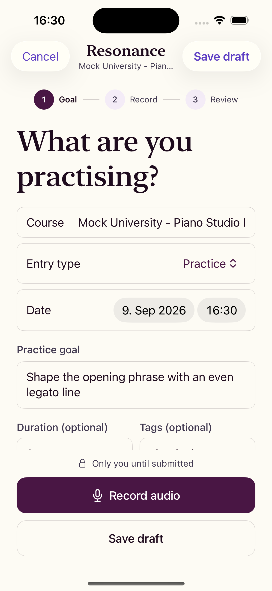
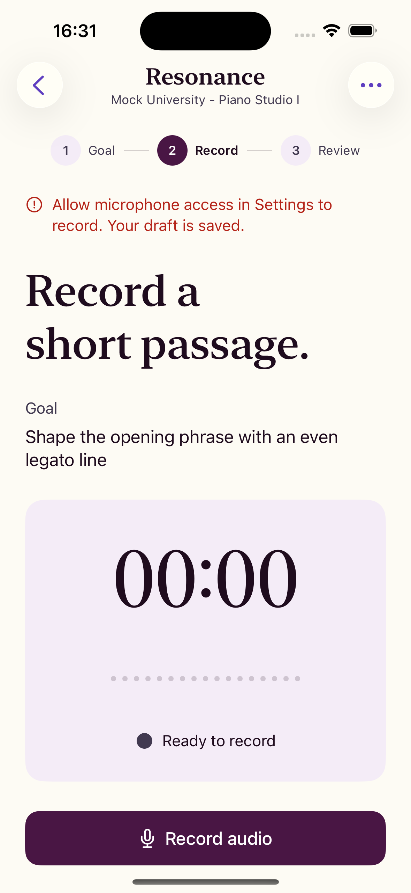
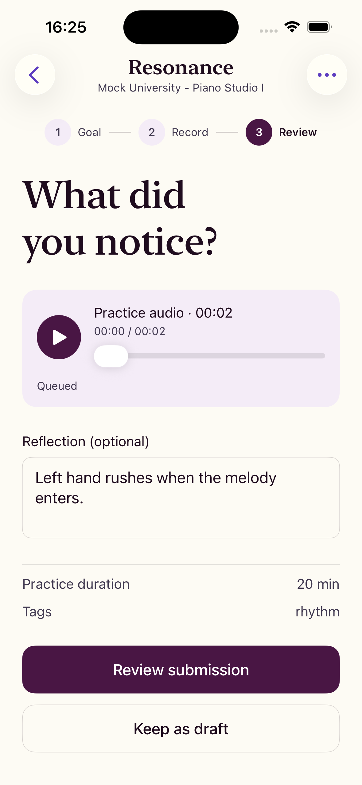
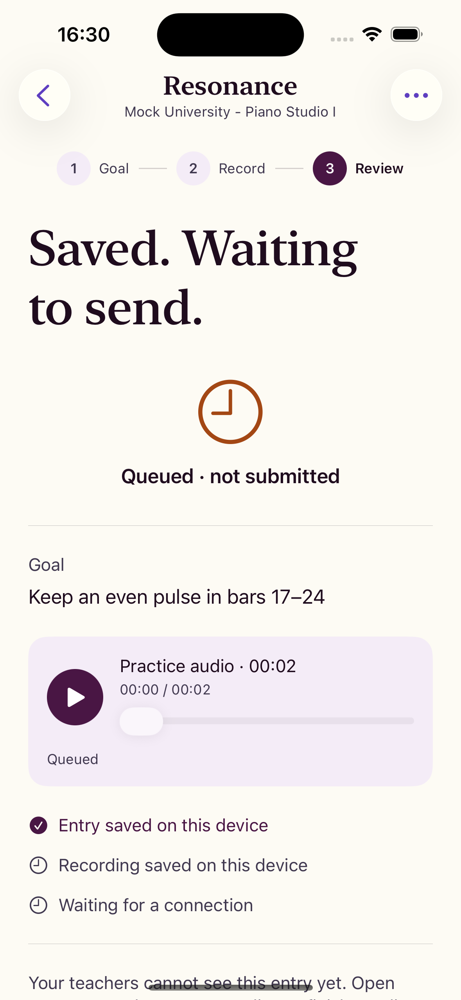
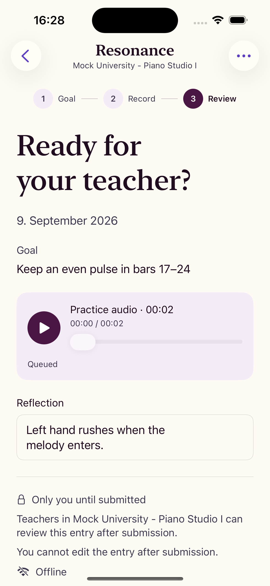
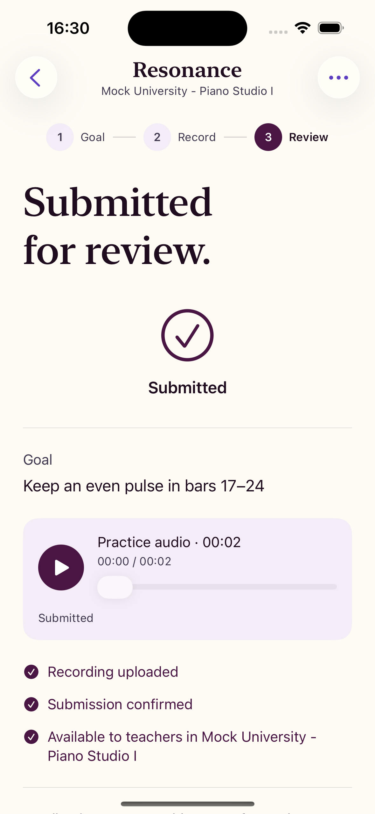
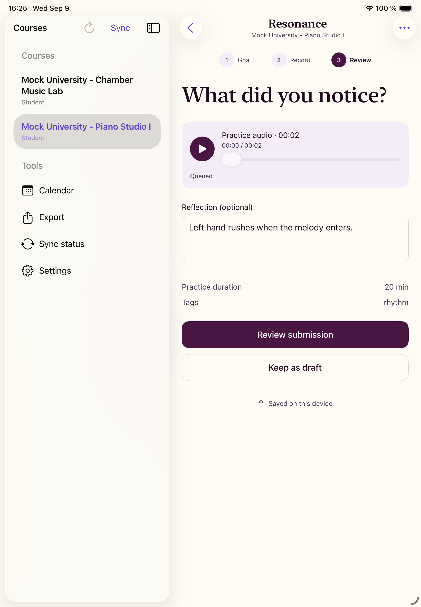
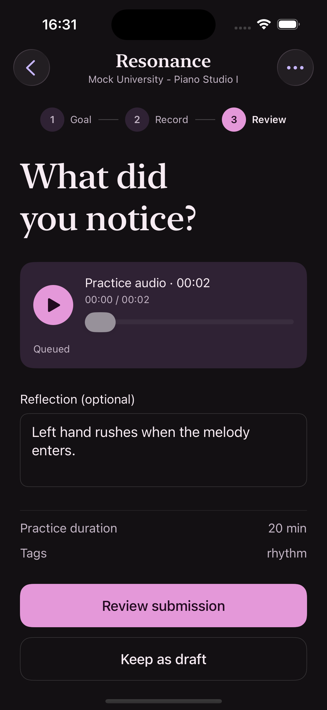
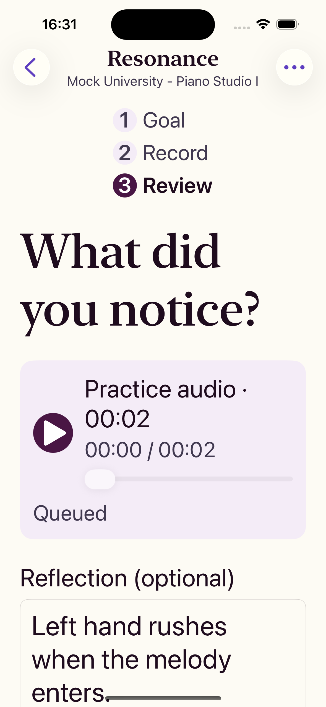

# Resonance

A music practice journal with timestamped teacher feedback.

[](https://github.com/sebastianspicker/resonance-practice/actions/workflows/ci.yml)
[](https://sebastianspicker.github.io/resonance-practice/)
[](LICENSE)

Resonance is an offline-first practice journal for music students and their
teachers. Students record private practice audio (or consented teaching-lesson
video), note what they noticed, and submit an entry to a course. Teachers review
the submissions they can see and leave timestamped feedback.

Every change is written on the device first, so the app keeps working when the
connection drops and syncs in the background when it returns.

What you get:

- **Offline-first capture.** Entries, audio, and reflections are saved on the
  device before anything touches the network.
- **Consent-aware lesson video.** Teaching-lesson capture requires explicit
  per-recording consent.
- **Course-scoped review.** Teachers see only what their course membership
  exposes, and leave feedback timestamped against the audio.
- **One typed sync contract.** Every resource change flows through a single
  idempotent, owner-bound command endpoint.
- **Private media by default.** Uploads are checksum-bound; downloads are
  short-lived and authorized.

This repository is the source for the iOS app and the server it syncs with. It
is an early alpha: there is no hosted service, signed build, production identity
integration, or support commitment. The
[interactive walkthrough](https://sebastianspicker.github.io/resonance-practice/) is a
presentation-only page that uses mock data and does not connect to the app or
server.

## Screenshot tour

Captured from the iOS app running in a simulator against the deterministic demo
fixture. No real student data or recordings are shown.

<table>
  <tr>
    <td width="50%" align="center">
      
      <br /><b>Prepare</b>
      <br /><sub>Set the goal, entry type, and optional tags before recording.</sub>
    </td>
    <td width="50%" align="center">
      
      <br /><b>Record</b>
      <br /><sub>Microphone denial keeps the saved draft and explains how to fix it.</sub>
    </td>
  </tr>
  <tr>
    <td width="50%" align="center">
      
      <br /><b>Reflect</b>
      <br /><sub>Play the take, scrub to any point, and write down what to work on.</sub>
    </td>
    <td width="50%" align="center">
      
      <br /><b>Queue</b>
      <br /><sub>Submitting moves the entry into the local outbox until it can sync.</sub>
    </td>
  </tr>
  <tr>
    <td width="50%" align="center">
      
      <br /><b>Final review (offline)</b>
      <br /><sub>Recipient, privacy scope, and finality are shown before submitting.</sub>
    </td>
    <td width="50%" align="center">
      
      <br /><b>Submitted</b>
      <br /><sub>Confirmation is driven by the real submitted entry state.</sub>
    </td>
  </tr>
  <tr>
    <td width="50%" align="center">
      
      <br /><b>iPad</b>
      <br /><sub>The same flow inside the split-view course and tool shell.</sub>
    </td>
    <td width="50%" align="center">
      
      <br /><b>Dark appearance</b>
      <br /><sub>Lifecycle and privacy state stay legible without relying on color.</sub>
    </td>
  </tr>
  <tr>
    <td width="50%" align="center">
      
      <br /><b>Larger text</b>
      <br /><sub>Layouts reflow with Dynamic Type instead of clipping content.</sub>
    </td>
    <td width="50%" align="center">
      
      <br /><b>Final review (online)</b>
      <br /><sub>The review screen names the current connectivity state.</sub>
    </td>
  </tr>
</table>

The same tour is available as a gallery on the
[walkthrough site](https://sebastianspicker.github.io/resonance-practice/#screenshots).

## Components

| Path | Purpose | Runtime and lifecycle |
| --- | --- | --- |
| [`ios/ResonanceApp/`](ios/ResonanceApp/README.md) | Offline SwiftUI client: local persistence, capture, review, and synchronization | iOS/iPadOS 17+, built and tested with Xcode |
| [`server/`](server/README.md) | Fastify API: identity, authorization, persistence, media sessions, and synchronization | Private Node.js 24 package, built and run as one server monolith |
| [`demo/site/`](demo/site/README.md) | Presentation-only browser walkthrough | Dependency-free static files, published independently with GitHub Pages |
| [`contracts/`](contracts/v1-api-contract.json) | Canonical v1 routes and cross-client wire vocabulary | Checked against live server responses (Vitest) and the Swift networking models |
| [`infra/`](infra/docker-compose.yml) | Disposable PostgreSQL and S3-compatible storage (SeaweedFS) | Loopback-only Docker Compose for development and CI, not production |

The client and server build independently and share the v1 HTTP contract. Neither
is published as a reusable library. The
[architecture guide](docs/ARCHITECTURE.md) covers dependency direction and
runtime flows.

## Prerequisites

- Node.js 24.x and npm 10 or later
- Docker with Docker Compose for local PostgreSQL and S3-compatible storage
- macOS, Xcode, `xcrun`, `xcodebuild`, `jq`, and an available iPhone Simulator
  for the iOS verification lane

## Quick start

From the repository root:

```bash
cp server/.env.example server/.env
docker compose -f infra/docker-compose.yml up -d

cd server
npm ci
npm run prisma:generate
npm run prisma:migrate
npm run prisma:seed
npm run dev
```

The development server listens on `127.0.0.1:4000` by default. Open
`ios/ResonanceApp/ResonanceApp.xcodeproj` and run the shared `ResonanceApp`
scheme to start the client. The default endpoint is `http://localhost:4000` and
the native callback is `resonance://auth-callback`.

[Development](docs/DEVELOPMENT.md) covers test-database setup, demo fixtures,
iOS toolchain options, and the full validation matrix.

## Common checks

Run commands from the repository root unless a different directory is shown.

| Purpose | Command |
| --- | --- |
| Repository contracts, docs, fixtures, and publication hygiene | `./scripts/verify-repository.sh` |
| Server type-check and build | `cd server && npm run typecheck && npm run build` |
| Server tests | `cd server && npm test` |
| Server lint, dead-code, and duplication checks | `cd server && npm run quality` |
| Server formatting check | `cd server && npm run format:check` |
| iOS layering, build, and XCTest | `./scripts/verify-ios.sh` |
| Public Markdown links and images | `node scripts/validate-public-docs.mjs` |
| Full local CI with disposable services | `./scripts/ci-local.sh --with-docker` |

The full local CI lane also needs Docker-based ShellCheck and actionlint,
SwiftLint 0.63.2, and the exact Swift 6.3.3 toolchain. It creates or reuses the
loopback `resonance_test` database. Review the safety requirements in
[Development](docs/DEVELOPMENT.md) before running database commands.

## Documentation

- [Product](PRODUCT.md): supported workflows and product boundaries.
- [Design](DESIGN.md): interaction and accessibility principles.
- [Architecture](docs/ARCHITECTURE.md): component ownership, dependency rules,
  state, and runtime flows.
- [API](docs/API.md): current HTTP routes and synchronization contract.
- [Development](docs/DEVELOPMENT.md): setup, configuration, fixtures, tests, and
  quality checks.
- [Security model](docs/SECURITY.md) and [security policy](SECURITY.md):
  implemented controls, operator obligations, and private reporting.
- [OIDC integration](docs/SSO_BRIDGE.md): provider and native-app sign-in
  boundaries.
- [Contributing](CONTRIBUTING.md), [support](SUPPORT.md), and
  [releasing](docs/RELEASING.md): project workflows and scope.

## License

Resonance is available under the [MIT License](LICENSE).

## Repository naming

The repository is now [`resonance-practice`](https://github.com/sebastianspicker/resonance-practice), previously `resonance`. The product name and existing runtime, package, and data identifiers remain unchanged. The demo is at [the new Pages address](https://sebastianspicker.github.io/resonance-practice/).
