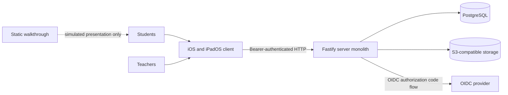
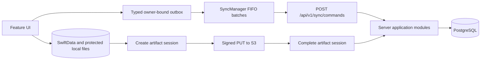

# Architecture

Resonance pairs one offline-first SwiftUI client with one Fastify/Prisma server
monolith. PostgreSQL holds application state, and S3-compatible storage holds
protected media. Running that stack in production is an operator task; this
repository provides the source and a disposable local setup.

At a glance:

- **Client.** One SwiftUI app for iPhone and iPad (`ios/ResonanceApp/`),
  organized into `App`, `Core`, `Features`, and `SharedUI`.
- **Server.** One Fastify/Prisma process (`server/`), split into `app`,
  `platform`, and six feature modules.
- **Data.** PostgreSQL for application state, S3-compatible storage for
  protected media; media bytes never pass through the sync endpoint.
- **Contract.** `contracts/v1-api-contract.json` carries the shared v1 wire
  vocabulary, and every resource mutation goes through
  `POST /api/v1/sync/commands`.

## System context



The client is the only product interface in this repository. The server is one
independently runnable process, not a set of microservices. `demo/site/` is
built and published on its own and has no runtime connection to the client,
server, or data stores.

## Server

`server/src/server.ts` is the public composition entry point. `server/src/app/`
assembles process lifecycle, transport middleware, readiness, and route
registration. `server/src/platform/` owns configuration, HTTP error and input
contracts, deadlines, and the S3 adapter.

| Module | Responsibility |
| --- | --- |
| `identity` | Development login, OIDC, token sessions, and issuer-scoped identity mapping. |
| `courses` | Course membership authorization and course reads. |
| `entries` | Course-scoped entry lists, entry reads, ownership, lifecycle queries, and deletion. |
| `media` | Artifact sessions, completion, protected download sessions, and cleanup. |
| `reviews` | Course review queues, feedback reads, and review-facing projections. |
| `sync` | Typed v1 command parsing, admission, receipts, idempotency, and ordered execution. |

Each module splits an `http/` adapter from an `application/` boundary: HTTP code
validates transport data and invokes application code, while application code
owns authorization and persistence transactions. The feature dependency graph
is acyclic — Entries may use Courses; Media may use Entries; Reviews may use
Courses and Entries; Sync may use Entries — and Identity and Courses otherwise
stand alone. Cross-feature imports target `application/` only. Modules may
depend on `platform`; `platform` never depends on modules or `app`.

## Client

The SwiftUI target is organized under `ios/ResonanceApp/Sources/`:

| Directory | Responsibility |
| --- | --- |
| `App` | Composition, app state, navigation, and demo dependencies. |
| `Core` | Domain models, persistence, networking, security, media, calendar, export, and synchronization. |
| `Features` | Course, capture, entry, feedback, review, authentication, settings, and sync-status workflows. |
| `SharedUI` | Reusable theme and presentation primitives. |

Features may depend on Core and SharedUI; Core must not depend on Features. App
composes features rather than holding domain logic. The durable Core outbox
holds typed, versioned commands bound to the authenticated local owner.

## Principal runtime flows



Normal resource changes are written to the device first and queued as typed
commands. `SyncManager` serializes ready work, sends at most 25 commands per
request, and preserves operation IDs and optimistic versions across retries.
The server executes a request in order under user- and operation-scoped
admission, persists a durable receipt, and rejects reuse of an operation ID for
different work.

Media bytes never pass through the sync endpoint. The client creates an owner-
and entry-bound upload session, uploads directly with its signed S3 capability,
and asks the server to complete the session. An artifact is published only after
storage metadata and bounded container evidence have been verified.

Completion shares one storage deadline across metadata, cached container probes,
and the final copy, and its database claim outlives that deadline. Background
storage deletion claims one job at a time with an expiring, token-bound lease;
revoked-token retention also runs in bounded background batches.

Course reconciliation consumes entry pages incrementally. Review queues return
marker counts with entry summaries, while entry detail keeps the complete marker
projection. Feedback uses an ascending `(createdAt, id)` cursor and the same
bounded page envelope as entry lists.

## HTTP contracts

`/health` and `/ready` are unversioned operational endpoints, `/auth/*` is an
unversioned authentication boundary, and resource reads and media sessions are
versioned under `/api/v1`.

All externally initiated resource mutations go through one endpoint:

```text
POST /api/v1/sync/commands
```

A request carries one to 25 typed commands. Each command includes an operation
ID, entity ID, kind, payload, and, where required, an optimistic base version.
The server runs commands in request order and persists a user-bound receipt.
Retries with the same operation and payload return the durable outcome;
reusing an operation ID for different work is rejected. Conflict results never
silently overwrite newer server state.

Artifact session creation, completion, and protected download-session creation
stay as versioned media operations because they issue or finalize scoped storage
capabilities. They are not a substitute for entry or feedback mutations.
Creation binds the requested artifact type, byte length, and padded-base64
SHA-256 checksum into the signed upload contract. Completion rechecks those
signed properties and reads bounded ISO-BMFF probes for a permitted M4A or MP4
brand and the expected audio or video track before publication.

There are no legacy unversioned resource-mutation routes. Extend the typed sync
command contract instead of adding resource-specific ones.

## Identity and persistence

Prisma owns PostgreSQL access. `ExternalIdentity` maps an `(issuer, subject)`
pair to a stable internal user, so an OIDC subject is never assumed globally
unique. The additive migration that introduces it also adds hashed browser-
binding, nonce, and PKCE verifier fields to persisted OIDC attempts. Existing
internal user IDs remain valid.

OIDC and internal app codes are short-lived and single-use, and the server
stores hashes of bearer values. Media storage is reached through the platform S3
adapter; application modules enforce ownership, course membership, and consent
before issuing capabilities or returning protected media.

There are two PKCE boundaries. The browser-to-provider attempt keeps its own
state, nonce, browser binding, and verifier. Separately, the native app
generates a verifier, sends its `app_code_challenge` at login, and must present
the matching `codeVerifier` when exchanging the internal code. The `redirectUri`
supplied at exchange must exactly equal `APP_AUTH_REDIRECT_URI`.

For an installed alpha, local persisted data is destructively reset only from the
known predecessor generation. Unknown or incomplete state fails closed and
requires user-directed recovery. This is a client persistence boundary, not an
operator migration procedure.

## Build and deployment boundaries

- The server is a private Node.js package. TypeScript compiles to `server/dist/`,
  and `dist/app/index.js` starts the one server process.
- The iOS app and XCTest bundle build from the tracked Xcode project and shared
  scheme. The Swift package manifest describes the same targets but is not a
  published library contract.
- `contracts/v1-api-contract.json` is the hand-maintained cross-component
  contract. A generated region in the Swift networking contract test projects
  its route and payload vocabulary.
- `infra/docker-compose.yml` supplies disposable loopback development
  dependencies. The repository has no production server image, infrastructure
  provisioning, application signing, TestFlight, backup, or monitoring workflow.
- `demo/site/` is the only deployed artifact described by repository automation;
  GitHub Pages publishes those static files independently.

Production TLS, secrets, CORS, PostgreSQL, S3, identity-provider operation,
backup, retention, monitoring, and distribution are operator-owned boundaries,
not features implemented here.

## Where new code belongs

- Add an endpoint in the owning module's `http/` directory.
- Put business rules, DTOs, authorization, and transactions in the owning
  module's `application/` directory.
- Put Fastify-wide behavior, configuration, errors, deadlines, and storage
  adapters in `platform/`.
- Put iOS workflow UI in `Features`, reusable transport and state in `Core`, and
  generic visuals in `SharedUI`.
- Update [API](./API.md), tests, and Swift transport/outbox models when a public
  contract changes.

## Extension rules and non-goals

- Extend the existing owning module rather than adding a second composition root
  or another deployable service.
- Add resource mutation behavior as a typed sync command. Media capability
  creation and completion stay separate because the client transfers bytes
  directly to storage.
- Treat the static walkthrough as presentation, not as product evidence or a
  test client.
- A SAML-only institution needs an external SAML-to-OIDC bridge; this repository
  implements OIDC, not SAML.

Component setup and verification live in the [server README](../server/README.md),
[iOS README](../ios/ResonanceApp/README.md), and
[development guide](./DEVELOPMENT.md).
